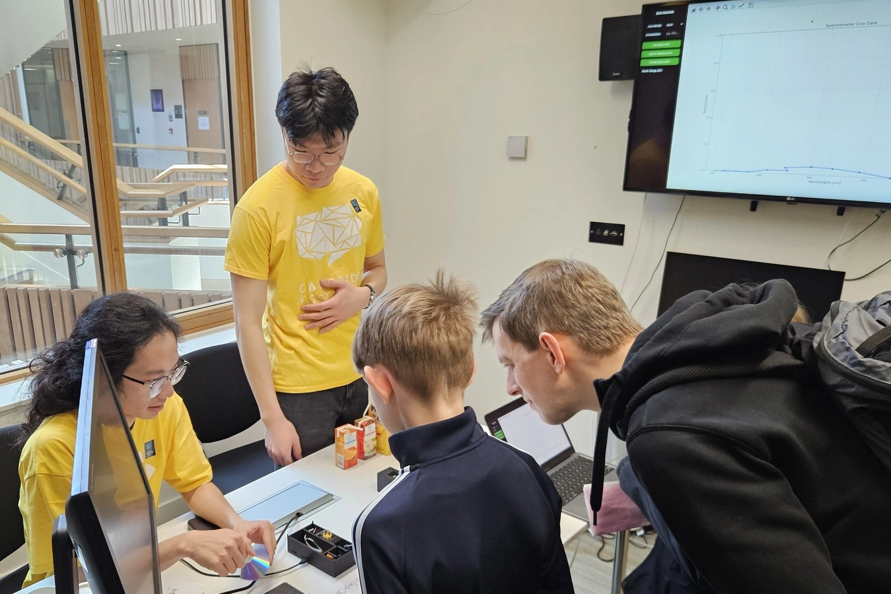
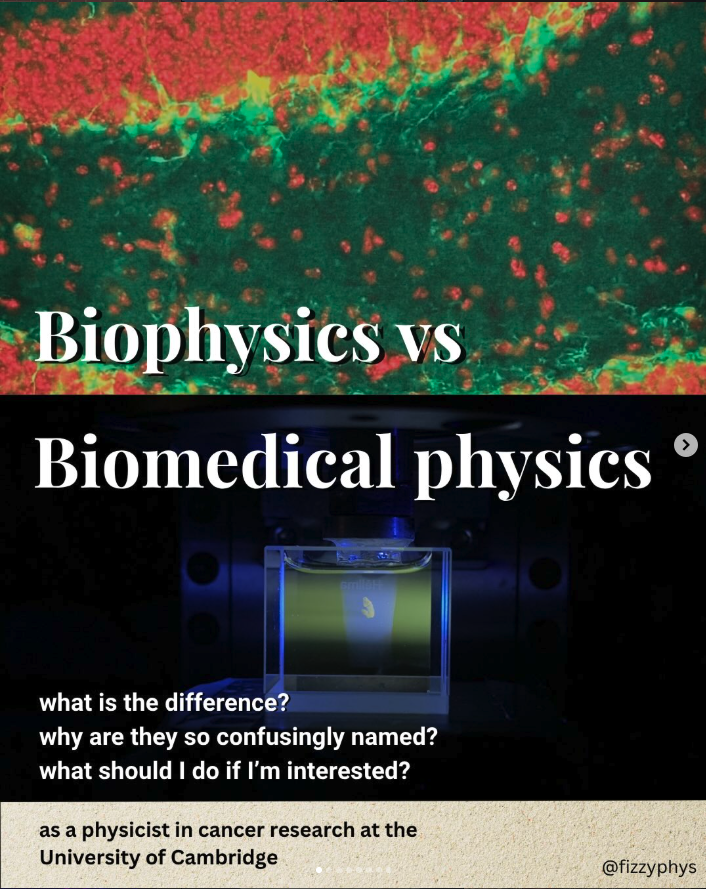
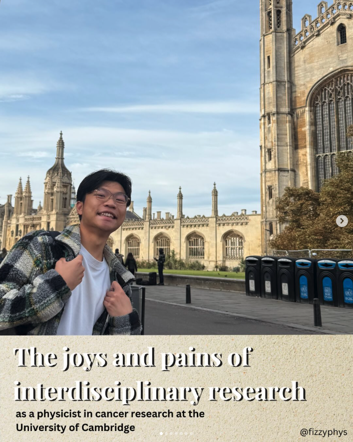
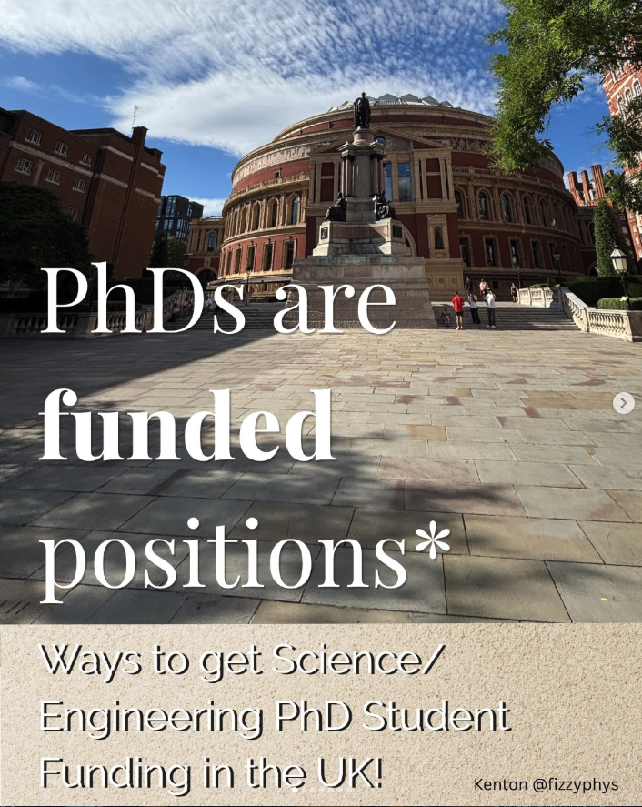
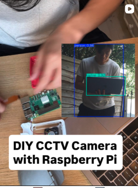
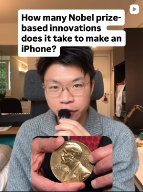

+++
title = "Outreach and scientific communication"
path = "outreach"
+++

I run an instagram account called FizzyPhys and through the platform I want to share interesting science related stories and life working in STEM. On top of this work, I have presented with the [University of Cambridge](https://cdt.sensors.cam.ac.uk/news/sensor-cdt-cambridge-festival-2026) and at the [London International Youth Science Forum](https://www.liysf.org.uk/).

These are some posts I have enjoyed making, but my full page is [here](https://www.instagram.com/fizzyphys/).

If our interests align, I'd love to work with you and please feel free to contact me via email (me [at] kentonk [dot] com).

    <a href="https://www.instagram.com/p/DZSYDyLjCN4/?img_index=1">
    
Demystification of two similar fields
</a>
    <a href="https://www.instagram.com/p/DYsH67jDFya/?img_index=1">
What it feels like to not be in a 'pure' field.
</a>
    <a href="">
Diffractive glasses!
</a>
    <a href="">
X-ray Computed Tomography
</a>
    <a href="https://www.instagram.com/p/DaaN-TyjKqC/?img_index=1">
A small guide to PhD applications.
</a>
    <a href="https://www.instagram.com/p/DOQxeFkDNmw/">
A fun mini-project
</a>
    <a href="https://www.instagram.com/p/DSKWFCcjIVS/">
At least 10?
</a>

# Resources

## For the undergraduate: Applying for research experiences

I would highly recommend students to seek diverse experiences, whether it be in research, industry, or something started by yourself :)

- Institute of Cancer Research Undergraduate [Summer Scholarship Scheme](https://www.icr.ac.uk/studying-and-training/undergraduate-summer-scholarship-scheme)
- Francis Crick institute [Summer Student Training program](https://www.crick.ac.uk/careers-study/students/summer-students)
- Cancer Research UK [Summer Research Programme](https://www.cruk.cam.ac.uk/students/undergraduate-summer-research-programme/)
- EPFL [Summer@EPFL](https://summer.epfl.ch/), [Quantitative biology](https://www.epfl.ch/schools/sv/education/summer-research-program/)
- Germany DaaD [RISE](https://www.daad.org.uk/en/find-funding/undergraduate-funding-opportunities/research-internships-in-science-and-engineering-rise/)
- Imperial College London [UROP](https://www.imperial.ac.uk/urop/what-is-urop/)

I'd also encourage students to seek out **good and encouraging mentors**, perhaps 1-2 steps ahead of you for relevant and relatable advice.
